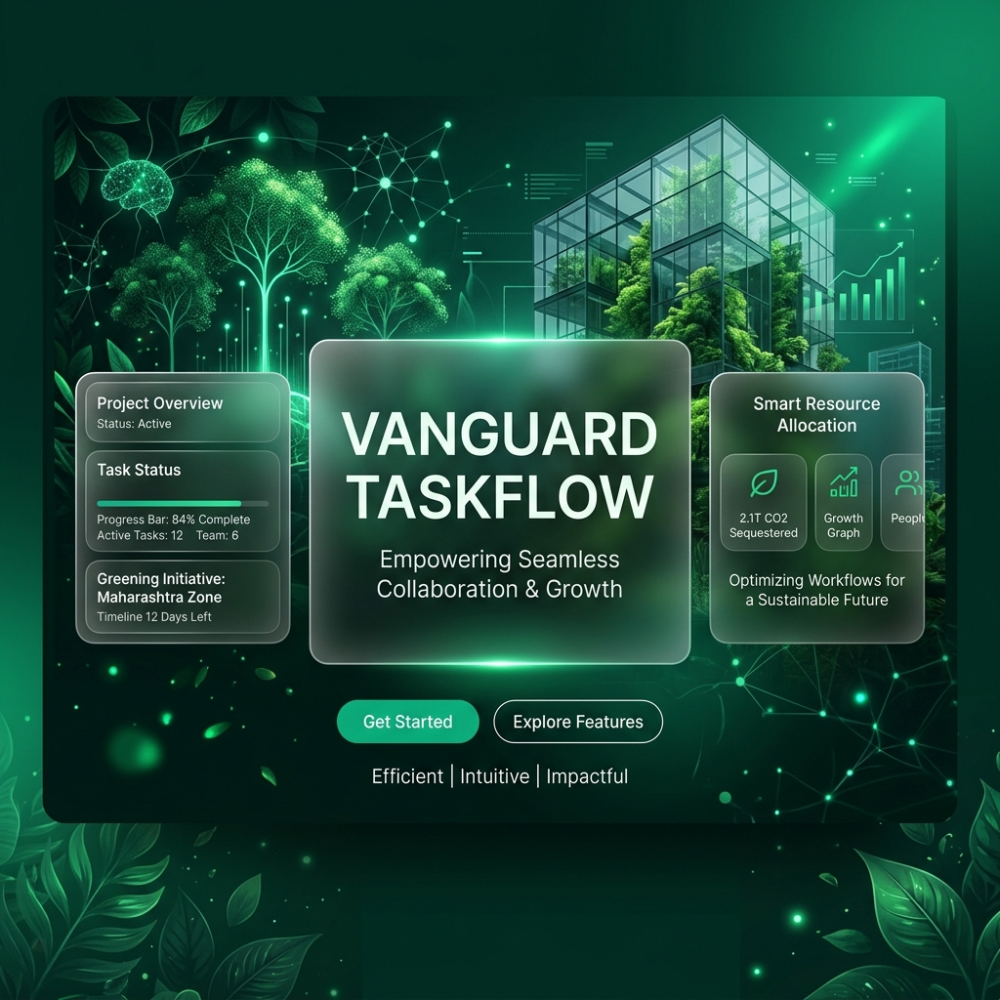

# Vanguard TaskFlow: Greening India Edition
### High-Performance Orchestration | Biophilic Glassmorphism | Pure Class Aesthetic

## 🌿 The Mission: Greening India
Vanguard TaskFlow is a high-end productivity ecosystem custom-engineered for the **Zomato Greening India Initiative**. It moves beyond standard "Project Management" into a realm of **Biophilic Design**, where the interface reflects the organic growth and sustainability goals of the mission.

---

## ⚡ The "UI Genius" Experience
The platform features a world-class **Tri-State Theme Engine** specifically designed to solve the Zomato brief:

*   **Greening India (Flagship)**: A deep emerald palette (`#022c22`) with "Chlorophyll" light leaks, designed to evoke a high-tech observatory overlooking a forest.
*   **Obsidian Night**: A sleek, dark interface for deep-focus engineering.
*   **Zomato Day**: A clean, light aesthetic utilizing Zomato's signature Red (`#e11d48`) for high-impact primary actions.

### 🎨 Philosophy of the Biophilic Vanguard
This project solves the Zomato design brief by harmonizing two contrasting energies: **Internal Energy** and **Botanical Stability**.

- **Desktop Experience**: Utilizes the vast viewport to create a "Cinematic Staging" area. Elements use a 120Hz refresh cycle to ensure that every scroll and hover feels as fluid as the nature it represents.
- **Mobile Experience**: Reimagines the traditional "Top Nav" into an ergonomic **Floating Pill Architecture**. By relocating the theme controls to the bottom-center, we ensure high usability for one-handed operation while preserving the brand logo's visibility at the top.
- **The Design Soul**: Zomato's signature **Crimson Red (#e11d48)** is preserved exclusively for high-vitality actions (creating tasks, critical alerts), while the **Greening India Emerald (#022c22)** provides the foundational calm for productive focus.

---

## 📸 Screenshots (Original App Capture)
| **"Eco-Obsidian" Login** | **Biophilic Dashboard** |
| :---: | :---: |
|  |  |
| **Project Detail View** | **Mobile Floating Navigation** |
|  |  |

> [!TIP]
> **Tri-State Glow Capsule**: The header features a persistent 160px capsule for seamless switching between Dark, Green, and Light modes.
> 

---

## 🛠️ The Vanguard Tech Stack
Built for extreme performance and low-latency orchestration:

| Layer | Technology |
| :--- | :--- |
| **Backend** | **Go (Golang) 1.22** · Chi Router · pgx/v5 (Binary protocol) |
| **Frontend** | **React 18** · TypeScript · Vite · **Framer Motion** · Tailwind CSS |
| **Database** | **PostgreSQL 16** (Optimized for UUID & pgcrypto) |

---

## 👥 The Vanguard Team (India Roster)
The system is pre-seeded with a localized Indian engineering team:
- **Arjun Mehta** (Lead Orchestrator)
- **Priya Sharma** (Design Strategy)
- **Ishaan Malhotra** (Systems Architect)
- **Ananya Singh** (Product Flow)
- **Rohan Gupta** (Data Integrity)

*All pre-seeded accounts share the password:* `password123`

---

## 🚀 Rapid Deployment
1.  **Spin up the Containerized Ecosystem**: `docker compose up --build -d`
2.  **Inject the Vanguard Seed Data**: `docker exec -i [db-container-id] psql -U taskflow -d taskflow < backend/seed.sql`
3.  **Access the Observatory**: [http://localhost:3000](http://localhost:3000)

---
*Created with "UI Genius" specifications for the Zomato Greening India Engineering Take-Home.*
