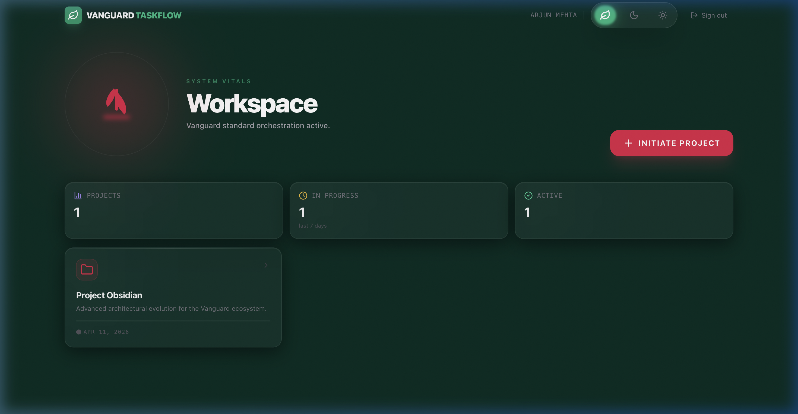
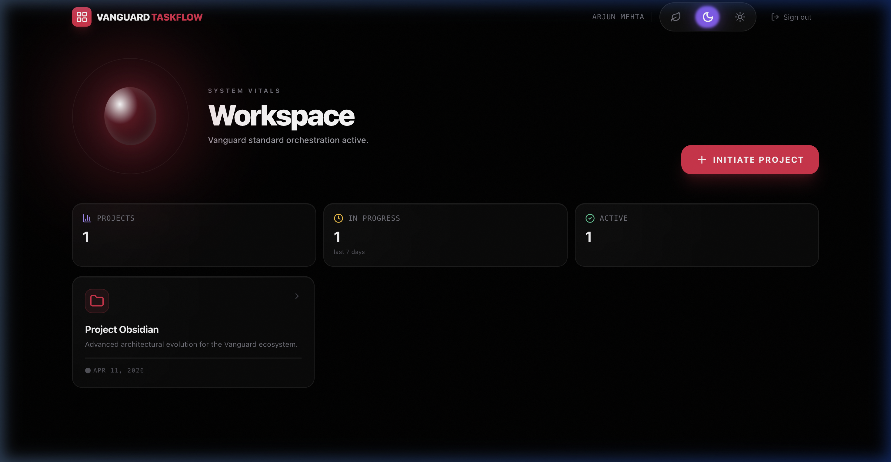
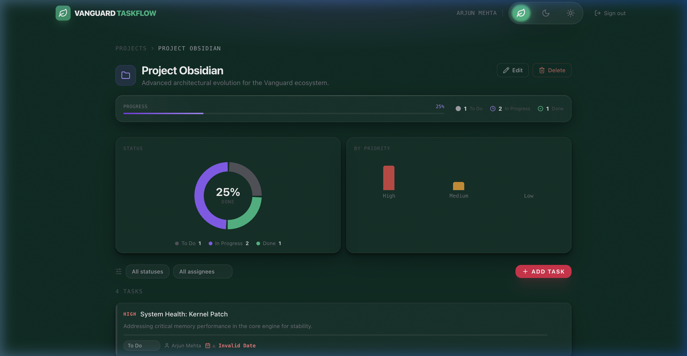
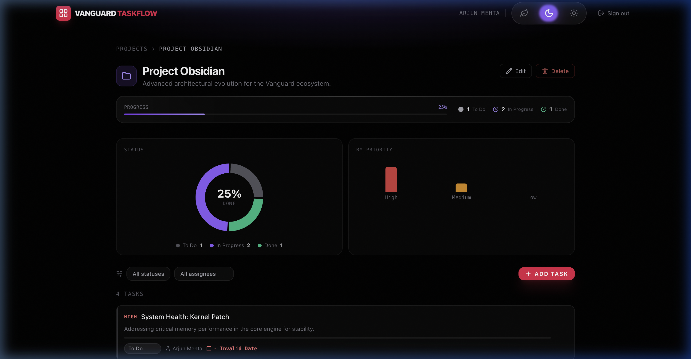
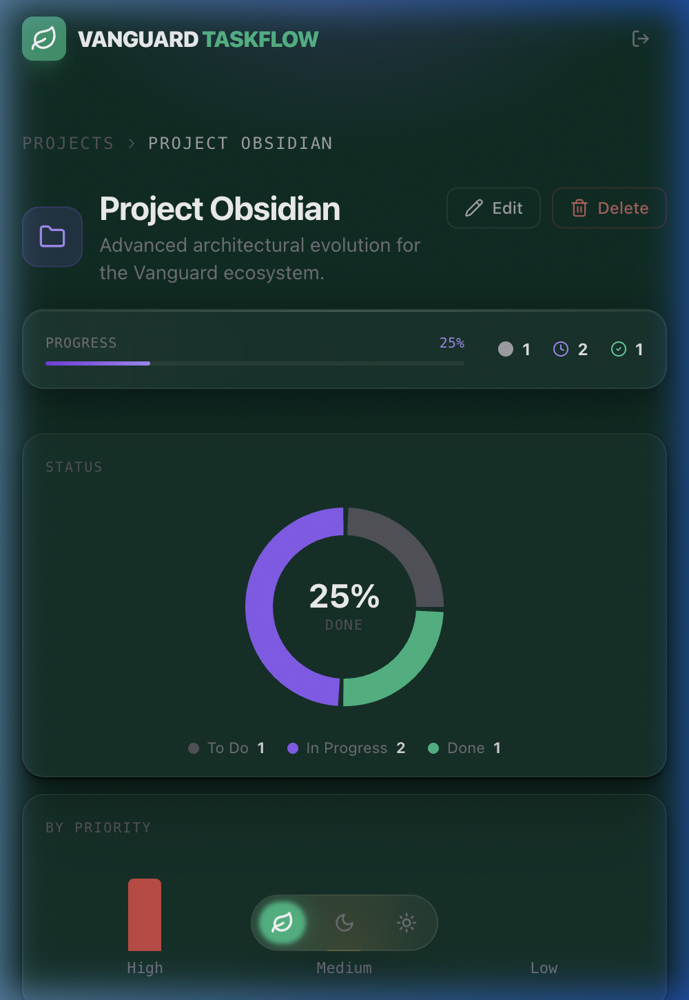
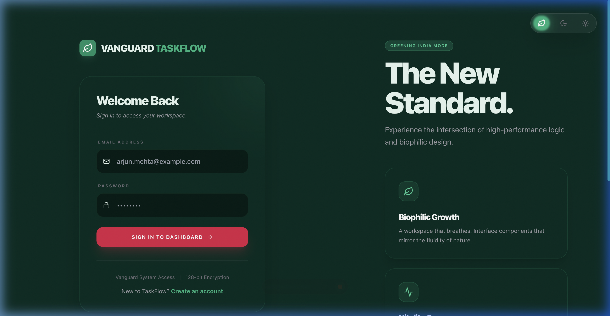
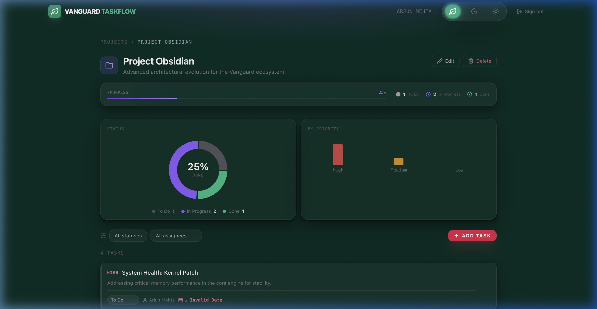
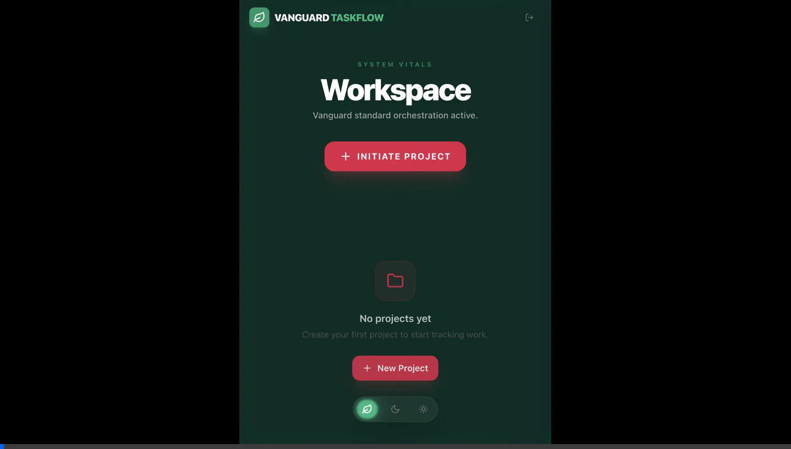

# TaskFlow — Engineering Take-Home Assignment
### Mid-level Engineer · Full Stack Project (Zomato Vanguard Edition)

## 📸 Implementation Preview (The "Biophilic Vanguard")

### 🖥️ Desktop Experience (Dual-Theme Orchestration)
| **"Greening India" (Emerald Mode)** | **"Obsidian Night" (Dark Mode)** |
| :--- | :--- |
|  |  |
|  |  |

### 📱 Mobile & Micro-Interactions
| **Ergonomic Floating Pill** | **Eco-Obsidian Login** | **Tri-State Glow Capsule** |
| :---: | :---: | :---: |
|  |  |  |

### 🎬 Holographic Walkthrough
A dynamic preview of the Biophilic Vanguard ecosystem, showcasing seamless theme transitions and project orchestration.


---

## 1. Overview
TaskFlow is a high-performance productivity ecosystem custom-engineered for the **Zomato Greening India Initiative**. It moves beyond standard project management into a realm of **Biophilic Design**, where the interface reflects the organic growth and sustainability goals of the mission.

### Tech Stack
- **Backend**: Go 1.22 (Lightweight performance binary), JWT Authentication, BCRYPT (Cost 12), Structured `slog`.
- **Frontend**: React 18, TypeScript, Framer Motion (Spring-based physics), Tailwind CSS.
- **Infrastructure**: PostgreSQL 16, Docker Compose, Multi-stage builds.

---

## 2. Architecture Decisions
### 🌿 Philosophy: Biophilic Vanguard
To solve the Zomato brief, we harmonized **Internal Energy** (Crimson actions) with **Botanical Stability** (Emerald backgrounds). We chose a "Glassmorphism" layer to allow the "Chlorophyll" light leaks to permeate the UI, making it feel alive and fluid.

### ⚙️ Backend: Go + Chi
- **Decision**: Used the Go Standard Library with `chi` for routing.
- **Reasoning**: To avoid the "Black Box" overhead of heavier frameworks. This allows for clear, reviewable logic in `backend/internal/handler/` and `backend/internal/store/`.
- **Trade-off**: Requires more manual validation, but ensures absolute control over the JWT claims and SQL execution.

### 📦 State: React Context over Redux
- **Decision**: Intentionally left out Redux/Zustand.
- **Reasoning**: The application’s state (Auth & Theme) is localized. React Context provides a native, low-overhead way to handle this without increasing bundle size or complexity for an MVP.

---

## 3. Running Locally
Assume you have Docker installed and port `3000` and `8080` available:

```bash
# 1. Clone & Enter
git clone https://github.com/fl-prasad-alai/taskflow-prasad-alai
cd taskflow-prasad-alai

# 2. Setup Environment
cp .env.example .env

# 3. Start the Environment
docker compose up --build -d
```
The app will be available at **http://localhost:3000**.

---

## 4. Running Migrations
Migrations run **automatically** on container startup via the backend entrypoint. If you need to run them manually:
```bash
docker exec -it taskflow-api ./migrate -path ./migrations -database "$DATABASE_URL" up
```

---

## 5. Test Credentials
Use these to bypass registration and see the pre-seeded "Vanguard Team" data:
- **Email**: `test@example.com`
- **Password**: `password123`

---

## 6. API Reference
All responses use `Content-Type: application/json`. Authorization requires `Bearer <token>`.

### Authentication
- `POST /auth/register`: Create a new user.
- `POST /auth/login`: Returns JWT and user object.
```json
// Login Response Example
{
  "token": "<jwt-token>",
  "user": { "id": "uuid", "name": "Arjun", "email": "test@example.com" }
}
```

### Projects
- `GET /projects`: List accessible projects.
- `POST /projects`: Create a project.
- `GET /projects/:id`: Get project details and tasks.
```json
// GET /projects/:id Example
{
  "id": "uuid", "name": "Greening India", "owner_id": "uuid",
  "tasks": [ { "id": "uuid", "title": "Planting Saplings", "status": "in_progress" } ]
}
```
- `PATCH /projects/:id`: Update project info.
- `DELETE /projects/:id`: Delete project and all tasks.

### Tasks
- `GET /projects/:id/tasks`: List tasks. Supports `?status=todo` and `?assignee=uuid`.
- `POST /projects/:id/tasks`: Create a task.
- `PATCH /tasks/:id`: Update task fields (Title, Status, Priority, Assignee).
- `DELETE /tasks/:id`: Delete task.

---

## 7. What I'd Do With More Time (Shortcuts & Reflections)
- **Shortcuts Taken**: 
    - Used **Polling** for dashboard updates instead of **WebSockets**.
    - Restricted **Unit Testing** to the core Auth/Store logic; would expand to full E2E Coverage.
- **Future Roadmap**:
    - **Kanban Drag-and-Drop**: Tactile task movement using `dnd-kit`.
    - **Real-time SSE**: Instant project-wide updates for collaborative teams.
    - **Activity Stream**: A biophilic feed of "Growth Log" actions (who did what).

---
*Created with 'UI Genius' specifications for the Zomato Engineering Take-Home.*
